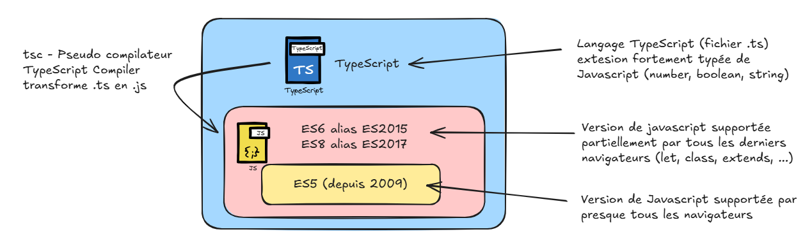

# TYPESCRIPT

## Introduction : Pourquoi TypeScript ?
### Objectifs

- Déconstruire les idées reçues
- Comprendre la valeur ajoutée par rapport à JavaScript



### Contenu

- JavaScript : liberté ↔ bugs silencieux
- TypeScript = JavaScript + types
- Compilation : `.ts → .js`
- Erreurs détectées avant l’exécution
- Cas concrets :

    - `undefined is not a function`
    - erreurs d’API
    - refactoring dangereux


### Caractéristiques 

- langage de programmation libre et open-source 
- améliore la programmation JavaScript en apportant plus de rigueur (typage fort optionnel) et une approche orientée objet
- sur-ensemble de JavaScript (i.e. tout code JavaScript correct peut être utilisé avec TypeScript)
- utilisation est obligatoire au niveau du framework **Angular**
- facultatif avec d'autres frameworks JavaScript très connus (React, Node.js / Express, ...)

### Comportement

- Tant que l'on n'ajoute pas de spécificités TypeScript, le fichier `.js` généré est identique au fichier `.ts`
- Si, par contre, on ajoute des précisions sur les types de données au sein du fichier `.ts` alors :
    - Le fichier `.js` est bien généré (par simplification ou développement) si aucune erreur bloquante n'est détectée
    - Des messages d'erreurs sont émis par **tsc** si des valeurs sont incompatibles avec les types des paramètres des fonctions appelées ou des affectations de variables programmées


### Démo

```TypeScript
function add(a, b) {
  return a + b
}

add(2, "3")
```

Puis version TypeScript :

```TypeScript
function add(a: number, b: number): number {
  return a + b
}

add(2, "3")
```

Message clé : TypeScript ne remplace pas JavaScript, il le sécurise.

## TypeScript dans un vrai projet

### Objectifs

- Savoir l'utiliser concrètement après le cours

### Installation de TypeScript via npm

De façon à télécharger et lancer le compilateur **tsc**, on pourra (entre autres possibilités) s'appuyer sur Node.js/npm (à préalablement télécharger/installer si nécessaire -> en suivant ce [lien](https://nodejs.org/en/download/))

### Contenu

- Initialiser le projet 

```Bash
npm init
npm install typescript
tsc --init
```

- Configurer le projet en modifiant le fichier `tsconfig.json`
- REM: il est recommandé de créer deux dossiers `src` et `dist` pour séparer les fichier `.ts` et `.js` de manière propre

## Les types fondamentaux

### Objectifs

- Savoir typer les variables simples
- Comprendre l’inférence

|Types      |	Exemple(s) ou signification(s)                                                      |
|:----------|:------------------------------------------------------------------------------------|
|:boolean   |	let isDone :boolean = false;                                                        |
|:number    |	let height :number = 6; ou let size :number = 1.83;                                 |
|:string    |	let name :string = "bob"; ou name = 'smith';                                        |
|:Array     |	let list1 :number[] = [1, 2, 3]; ou let list2 :Array<number> = [1, 2, 3];           |
| enum      |	Énumération                                                                       |
|:any       |	let notSure :any = 4; ou notSure = "maybe a string instead"; ou notSure = false;    |
|:void      |	function warnUser() :void { alert("This is my warning message"); }                  |
|:object    |	Objet quelconque : plus précis que any, moins précis qu'un nom de classe            |
            
### Contenu

- Types primitifs :

    - number, string, boolean
    - null, undefined

- Enumeration :
```TypeScript
enum Color {Red, Green, Blue}; // start at 0 by default 
// enum Color {Red = 1, Green, Blue}; 
let c: Color = Color.Green;  //display as "1" by default 
let colorName: string = Color[1]; 
// "Green" if "Red" is at [0]
// Color["Green"] return 1​
```

- Objet :
```TypeScript
let obj : object = { id : 2  , label : "cahier" } ; 
obj = { prenom : "jean" , nom : "Bon" } ; 
//structure objet différente acceptée​
```

- Cohérence ou d'incohérence de type : :
```TypeScript
function greet(person : string): string {
    return "Hello, " + person;
}
let userName = "Power User";
//i=0; //manque var (erreur détectée par tsc)

let msg = "";
//msg = greeterString(123456); 
//123456 incompatible avec type string (erreur détectée par tsc)

msg = greet(userName);
console.log(msg);​
```

- Tableau :
```TypeScript
let var tableau :string[] = new Array<string>();
tableau.push("abc");​
```
```TypeScript
let jours : string[];
jours = [ "lundi" , "mardi" , "mercredi" , "jeudi" , "vendredi" ];
jours.push("samedi"); jours.push("dimanche");
for(const [i,jour] of jours.entries()){
    let j=jour.toUpperCase();
    console.log( `jour ${i} : ${j}`);
}
```


- `any` vs `unknown` (important)
- Inférence automatique :
```TypeScript
let age = 30 // TypeScript comprend : number
```

## Exercices pratiques
### Exercice

Convertir ce code JS en TypeScript :
```TypeScript
function formatUser(user) {
  return user.name.toUpperCase()
}
```

### Objectifs :

- typer les paramètres
- typer le retour
- détecter les erreurs potentielles

Correction collective commentée.

## Fonctions & typage avancé

### Objectifs

- Typage précis des fonctions
- Comprendre les unions et options

### Contenu

- Typage de fonctions :
```TypeScript
function greet(name: string): void {}
```

- Paramètres optionnels :
```TypeScript
function log(message: string, level?: string) {}
```

- Types union :
```TypeScript
// Deux types supportés
let id: number | string
// Précision sur des valeurs possibles de variables 
dialect : "mssql" | "mysql" | "postgres" | "sqlite" | "mariadb";​
```

- Valeurs par défaut + types :

```TypeScript
unite : string | undefined; // string ou bien undefined​

function greet(name: string = "Invité", age: number = 30): string {
  return `Bonjour ${name}, vous avez ${age} ans.`;
}
```


### Cas réel

API qui peut renvoyer plusieurs formats -> union types

## Objets, interfaces & classes

### Objectifs

- Structurer des données
- Comprendre le cœur de TypeScript

### Interfaces

```TypeScript
interface User {
  id: number
  name: string
  email?: string
}
```

- Différence `interface` vs `type`
- Propriétés optionnelles
- Readonly

### Classes

```TypeScript
class UserService {
  constructor(private users: User[]) {}

  getUser(id: number): User | undefined {
    return this.users.find(u => u.id === id)
  }
}
```

### Message clé

TypeScript brille dès qu'il y a de la structure


